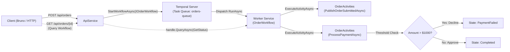

# Temporal & .NET Aspire Demo

A distributed .NET 10 solution demonstrating durable execution and workflow orchestration using [Temporal](https://temporal.io/) and orchestrated locally with [.NET Aspire](https://learn.microsoft.com/dotnet/aspire/).

---

## 🏗️ Architecture & Workflow Flow



---

## 📂 Project Structure

```text
TemporalDemo/
├── src/
│   ├── TemporalDemo.slnx            # Modern XML Solution format (.slnx)
│   ├── TemporalDemo.AppHost/        # Aspire Orchestrator (Temporal Dev Server, Worker, ApiService)
│   ├── TemporalDemo.ServiceDefaults/# Shared OpenTelemetry, metrics, health checks
│   ├── TemporalDemo.Contracts/      # Shared contracts, workflow & activity interfaces
│   ├── TemporalDemo.ApiService/     # Web API (Workflow Starter & Query Endpoint)
│   └── TemporalDemo.Worker/         # Background Worker (Temporal Workflow & Activities)
├── bruno/                           # Bruno API test collection (OpenCollection YAML)
│   └── TemporalDemo/
├── .gitignore
└── README.md
```

---

## 🚀 Prerequisites

- [.NET 10 SDK](https://dotnet.microsoft.com/download)
- [Docker Desktop](https://www.docker.com/) or [OrbStack](https://orbstack.dev/)
- [Aspire CLI](https://learn.microsoft.com/dotnet/aspire/fundamentals/setup-tooling) (`aspire` command)
- [Bruno](https://www.usebruno.com/) (for executing API test requests)

---

## 🛠️ Getting Started

### 1. Start the Solution via Aspire

Aspire spins up the Temporal dev server container, Worker, and ApiService automatically:

```bash
aspire run
# or
dotnet run --project src/TemporalDemo.AppHost
```

### 2. Open the Aspire Dashboard & Temporal UI

When Aspire starts, click the dashboard URL printed in your terminal (e.g. `https://localhost:17...`).

In the dashboard, you'll find:
- **`apiservice`**: Assigned API endpoint.
- **`worker`**: Background Temporal worker hosting workflows and activities.
- **`temporal`**: Temporal server container with a direct link to the **Temporal Web UI** (e.g. `http://localhost:8233`).
- **Distributed Traces & Structured Logs**: Real-time OpenTelemetry tracking from HTTP requests through workflow and activity execution.

---

## 🧪 Testing

### Option A: Using Bruno

An automated API test suite is included in the `bruno/TemporalDemo` directory using the OpenCollection YAML format.

1. Open the [Bruno](https://www.usebruno.com/) desktop app.
2. Click **Open Collection** and select the `bruno/TemporalDemo` folder.
3. Select the **Local** environment (top right). *(Update `baseUrl` if Aspire assigned a dynamic port).*
4. Run:
   - **Health Check** (`GET /alive`): Validates Aspire health checks.
   - **Submit Order** (`POST /api/orders`): Submits an order (< $1000) and automatically stores `lastOrderId` into the environment.
   - **Submit Order (Decline Over $1000)** (`POST /api/orders`): Submits a high-value order ($1500) and captures `lastOrderId`.
   - **Get Order Status** (`GET /api/orders/{{lastOrderId}}`): Queries the live Temporal workflow state.

### Option B: Using the `.http` File

If using Visual Studio, JetBrains Rider, or VS Code with the REST Client extension, open [**`src/TemporalDemo.ApiService/TemporalDemo.ApiService.http`**](src/TemporalDemo.ApiService/TemporalDemo.ApiService.http) to execute requests directly in your editor.

---

## 📦 Key Packages Used

- **Temporalio** (`1.19.0`) & **Temporalio.Extensions.Hosting** (`1.19.0`) — Temporal .NET SDK for durable workflows and activities.
- **Aspire.Hosting.AppHost** (`13.5.4`) — Distributed application host orchestration.
